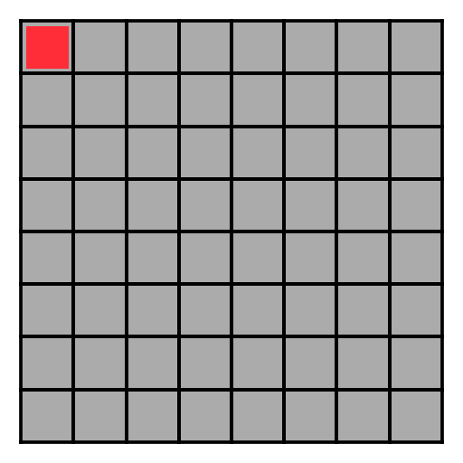

# maze-time
Explore the world of mazes.

Collection of functions to visualize maze algorithms.

## Generation of a maze

Impplemented algorithms:
    
- Binary-Tree (South-East)
- Aldous-Broder
- Hunt-and-Kill
- Randomized Depth-First-Search


You can create a main script like:

```python
import mazelib as ml

height  = 8
width   = 8
maze    = ml.gen_binary_tree_se(height,width,True)
```

This will generate a directory like:

    gen_maze_2024-05-31_14-45-57-070484/

In such directory thare is all the images of the maze generation:

    2024-05-31_14-45-57-302124.png
    2024-05-31_14-45-57-524776.png
    2024-05-31_14-45-57-765135.png
    2024-05-31_14-45-57-972846.png
    ...

## Make video of the maze generation

If you want to create a video of the generation, just write on terminal:

```bash
./make_video.py gen_maze_2024-05-31_14-45-57-070484/
```

This will create the file `gen_maze_2024-05-31_14-45-57-070484.mp4` from the images.

## Make gif of the maze generation

If you want to create a gif of the generation, just write on terminal:

```bash
./make_gif.py gen_maze_2024-05-31_14-45-57-070484/
```

This will create the file `gen_maze_2024-05-31_14-45-57-070484.gif` from the images.

## Examples

### Binary-Tree (South-East)



### Aldous-Broder


 
### Hunt-and-Kill


### Randomized Depth-First-Search

